## Documentación de tres programas en EMU8086
# Programa 1
Descripción:  
- Este programa imprime dos mensajes en la pantalla y espera a que el usuario presione una tecla antes de finalizar.
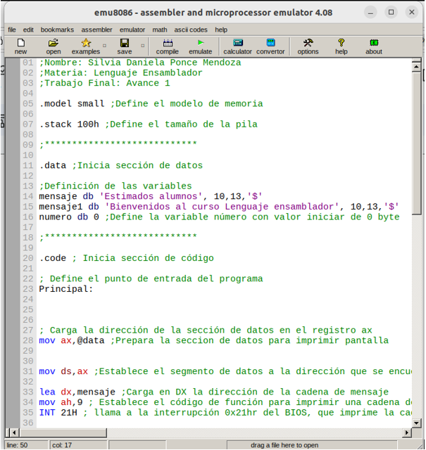
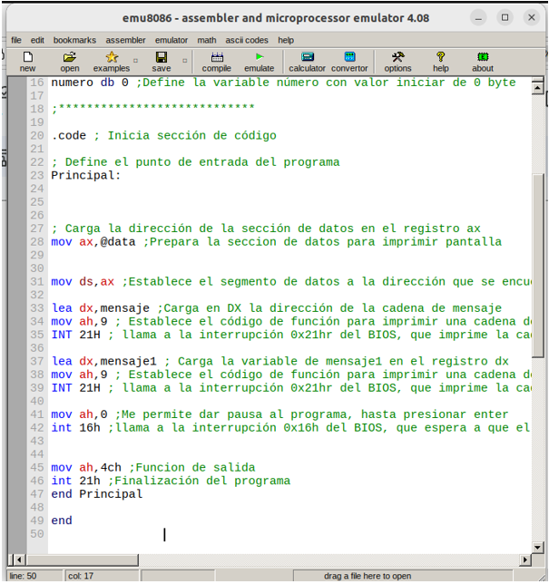
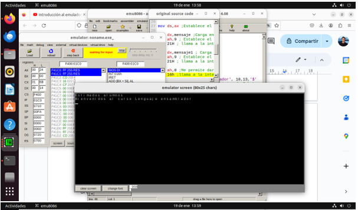

# Programa 2
Descripción: 
- Este programa escribe un mensaje en un archivo de texto y luego lo cierra antes de finalizar.
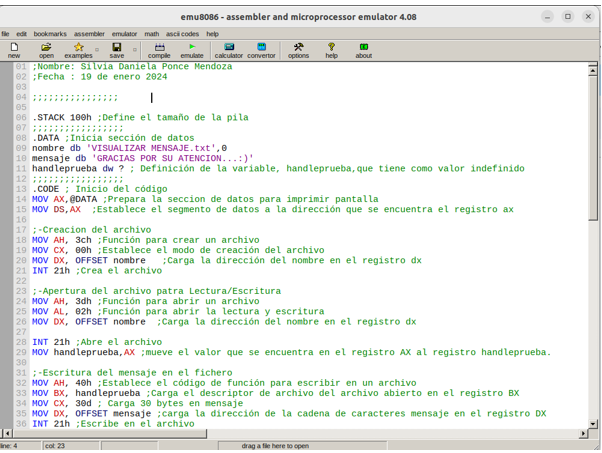
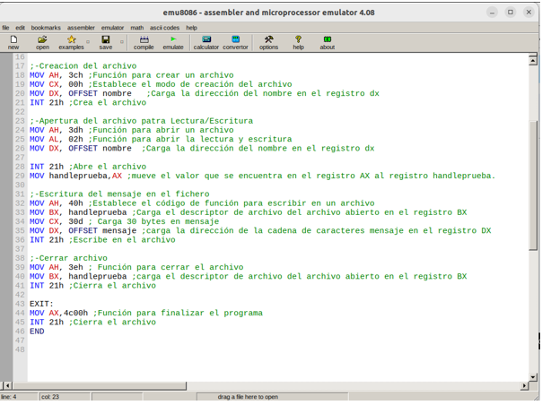
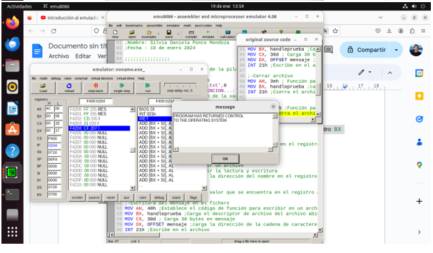

# Programa 3 
Descripción: 
- Este programa utiliza una biblioteca externa para imprimir mensajes en la pantalla y luego espera a que el usuario presione una tecla antes de finalizar.
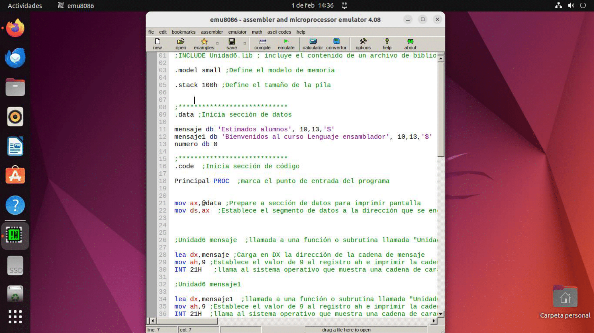
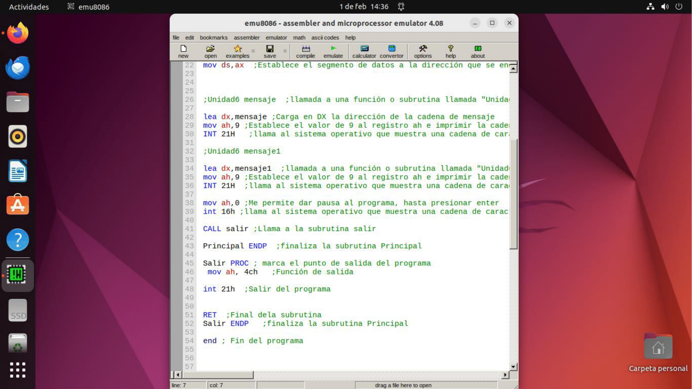
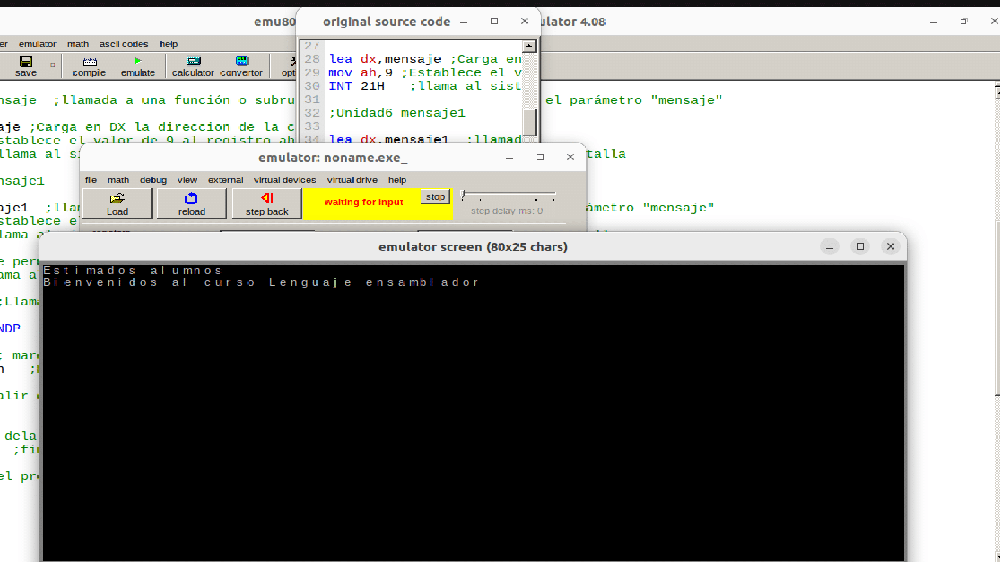
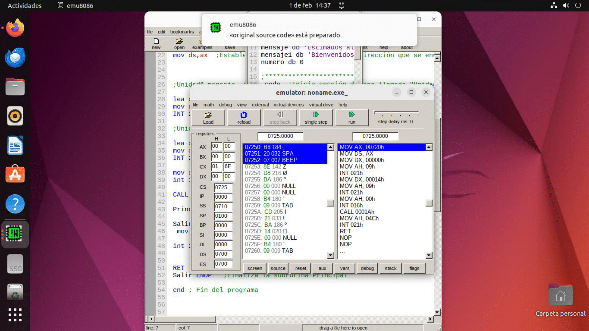
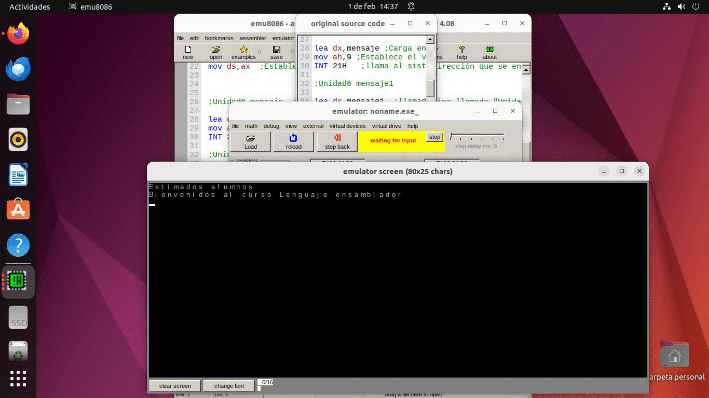

# Final 
Descripción: 
- Se realizó un programa en lenguaje ensamblador para emu8086 que maneje un un arreglo de datos para que acepte y reporte 10 series de los siguientes datos:
Nombre y apellido,
Número de cuenta (5 dígitos),
Crédito disponible.
En donde se incluya  una rutina para actualizar el crédito de un usuario al darle el número y el monto que puede ser positivo o negativo. Antes de actualizar debe mostrar los datos del cliente y confirmar.
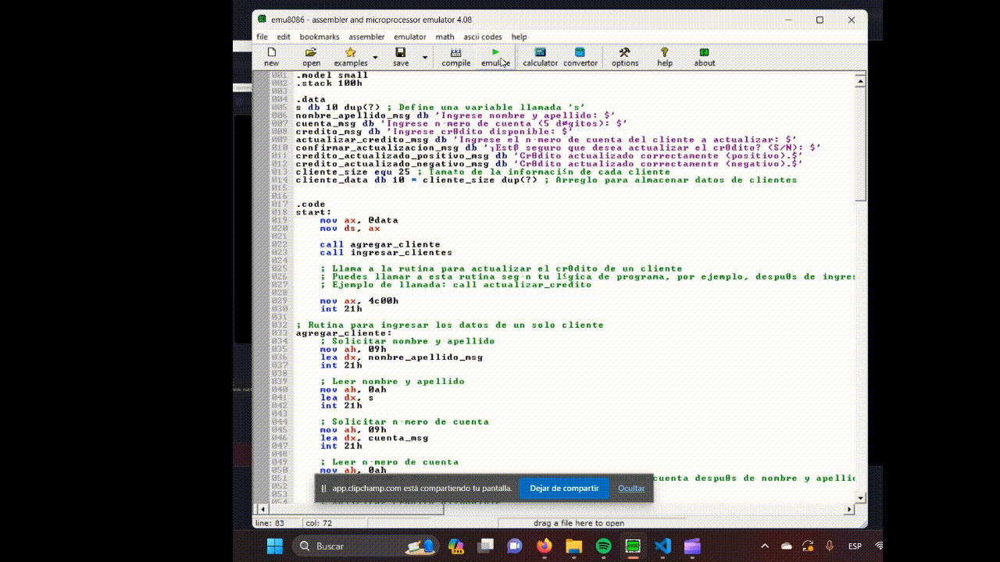